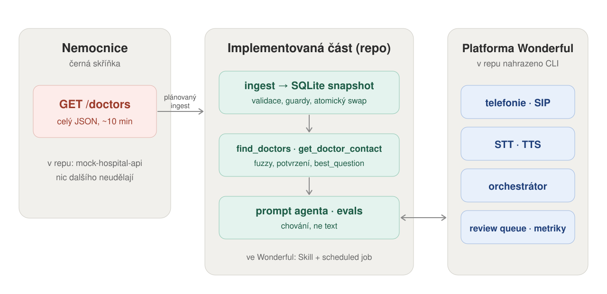

# Doctor directory bot

Hlasový bot pro linku nemocniční sítě: pacient zavolá, řekne jméno lékaře nebo
obor a město, bot ho najde a přečte kontakt. Zadání z pohovoru ve Wonderful.
Od nemocnice dostaneme jediný endpoint, který vrátí celý seznam a odpovídá
zhruba deset minut. Žádné webhooky, žádné inkrementální změny, nic jiného.

Co když se doktor přejmenuje? Nic, na doktory si nic nevážu a snapshot
přepisuju celý. A jménem by to stejně nešlo: ze 780 celých jmen nepatří žádné
jen jednomu člověku.

Předpoklady, otevřené otázky a definice úspěchu jsou v
[DISCOVERY.md](DISCOVERY.md), měření a rozhodnutí z nich v
[DECISIONS.md](DECISIONS.md).

## Cíl a výsledek

| co mělo platit | jak to dopadlo |
|---|---|
| endpoint se během hovoru nevolá | **splněno**, hovor čte jen lokální SQLite snapshot |
| když kandidátů sedí víc, bot nikdy žádného nepojmenuje | **splněno**, `must_ask` je v datech z toolu, ne v promptu |
| kontakt nevydat, dokud není identita jistá | **splněno strukturálně**, model u nejistého výsledku nedostane `id`, takže kontakt nemá čím načíst; ověřeno dvěma nátlakovými případy |
| akutní stav vždy „Volejte okamžitě 155." | **splněno deterministicky**, rozpoznané formulace se vyhodnotí před modelem; 3/3 v posledním běhu za 7, 0 a 1 ms |
| chování na reálných přepisech | **42/44 (95 %)** v posledním placeném běhu |
| co volající řekl, dorazí do toolu doslova | **otevřené**, model jednou zkrátil `stane zkus` na `stane` a tím obešel potvrzení |
| 95 % hovorů vyřízených bez předání člověku | **neměřitelné bez provozu**, containment se dá zjistit až ze shadow modu |

## 3 min summary

**Co jsem postavil.** Hlasový directory bot nad nemocničním endpointem, který
vrací celý seznam až za deset minut. Během hovoru endpoint nevolá: plánovaný
ingest validuje snapshot, atomicky ho prohodí v SQLite a agent nad ním má jen
dva read-only tooly, hledání a kontakt.

**Co rozhodla data.** Na plném 7029řádkovém snapshotu není jediné celé jméno
unikátní. Proto jsem zahodil původní nápad porovnávat snapshoty a hledat
identitu doktora: nic na něj není navázané, snapshot se prostě celý nahradí.
Jméno, město a obor rozliší 6969 řádků z 7029; když zůstane více kandidátů,
store vybere otázku, která jich vyřadí nejvíc.

**Jak jsem to zkoušel.** Do macOS diktování jsem nadiktoval 43 reálných českých
přepisů, včetně komolených rumunských jmen, rozsekaných měst, češtiny
s angličtinou a běžných hlasových výplní. Z nich vzniklo 44 behaviorálních
eval cases. Běhal jsem je přes skutečný Anthropic tool loop, ne jen přes unit
testy; historie, raw výsledky a atribuce chyb jsou v `evals/RUNS.md`.

**Co mi evaly vynutily.** Několik pravidel původně žilo jen v promptu. Po
reálných bězích jsou v kódu: explicitní akutní situace vrací před modelem
„Volejte okamžitě 155.“, nejednoznačný nebo nepotvrzený výsledek nedostane id,
takže z něj nejde vytáhnout kontakt, a neznámé město nebo obor nerozšíří hledání
na celý seznam.

**Jak to dopadlo.** Poslední plný běh skončil 42/44, tedy 95 %. Není to ale těch
95 % z discovery: cíl mluví o podílu hovorů vyřízených bez předání člověku,
kdežto eval sada je schválně sbírka těžkých případů, ne vzorek provozu. Dokud
neběží shadow mode vedle recepce, je eval skóre proxy a containment nemám čím
změřit.

**Kde je limit.** Jeden fail je checker, druhý je důležitější: model jednou
zkrátil `stane zkus` na `stane` ještě před toolem a tím obešel score-gated
confirmation. Evals to zachytily, ale současná verbatim garance je stále
promptová. Další pilotní krok je držet raw
STT span mimo model a jistotu počítat pesimisticky. Netvrdím, že je tato část
hotová.

## Kde končí moje část



Textem, kdyby se obrázek nenačetl:

- **Nemocnice** je černá skříňka. Jediné, co dává, je `GET /doctors`: celý JSON,
  odpověď kolem deseti minut. Nic dalšího na své straně neudělá. V repu ji
  zastupuje `mock-hospital-api`.
- **Implementovaná část** je tenhle repozitář. Plánovaný ingest do SQLite
  snapshotu (validace, guardy, atomický swap), nad ním dva tooly `find_doctors`
  a `get_doctor_contact` (fuzzy hledání, potvrzování jmen, `best_question`) a nad
  nimi prompt agenta a evals, které hlídají chování, ne text.
- **Platforma Wonderful** dodává telefonii a SIP, STT a TTS, orchestrátor a
  review queue s metrikami. V repu ji zastupuje CLI.

Ingest je naplánovaná úloha, dva tools Skill, prompt konfigurace agenta a evals
jejich kontrola. Preamble („Moment, podívám se") vracím zvlášť od odpovědi právě
proto, aby ho runtime přehrál během tool callu, protože tam se vnímaná latence
schovává. Jak často stahovat je řádek v cronu a otázka na nemocnici, ne
konstanta v kódu.

## Jeden hovor

Doslovný přepis běhu přes agenta z 15. 9. 2026, ze 277 kandidátů na jednoho ve
třech tazích. Počty vpravo jsou to, co v tom tahu vrátil tool.

```
👤 Hledám doktora Dumitresku                         277 kandidátů
🤖 Doktorů Dumitrescu mám víc. V jakém městě ordinuje — například
   v Mediaši, v Brašově, v Kluži, nebo v Romanu?

👤 V Kluži                                            11 kandidátů
🤖 V Kluži jich mám jedenáct. Jaké má křestní jméno — například Alina,
   Andrei, Bogdan, nebo Cristina?

👤 Alinu                                               1 kandidát
🤖 Mám ji: doktorka Alina Dumitrescu, psychiatrie, Clinica Cluj-Napoca
   Care. Přejete si kontakt nebo ordinační hodiny?
```

Nad 277 kandidáty se bot nezeptá na příjmení, které mají všichni stejné, ale na
město, protože to jich vyřadí nejvíc. „Například" v otázce znamená, že možností
je víc než ty čtyři jmenované, konkrétně 42 měst. Telefon ani adresu nepřečte,
dokud si o ně volající neřekne; v posledním tahu se jen zeptá, jestli je chce.

## Co ukázal plný snapshot

Následující čísla jsou z plného snapshotu ze zadání; v repu je jen
stratifikovaný 500řádkový vzorek pro reprodukovatelné testy.

7029 lékařů z 26 příjmení a 30 křestních jmen. **Žádné z 780 celých jmen
nepatří jen jednomu člověku**, nejčastější sdílí dvacet lidí, a proto hledání
nikdy nekončí na jméně. Kombinace jméno, město a obor jednoznačně rozliší
6969 z 7029 řádků (99,1 %); zbývajících 60 řádků tvoří 30 dvojic lišících se
jen telefonem, adresou a jazyky, a na ty se bot ptá jazykem a řekne proč.

Tři pasti. Klinik je 42 a měst 42 a v plném snapshotu tvoří bijekci: každé
město má jednu kliniku a každá klinika patří jednomu městu („Clinica {město}
Care“). Neznamená to jednu kliniku na jednoho lékaře, naopak mnoho lékařů sdílí
stejnou kliniku. Otázka na kliniku proto nepřinese nic navíc proti otázce na
město a v sadě disambiguačních otázek není. E-mail se odvozuje ze jména a
kliniky, takže 616 skupin lékařů, některé po třech i čtyřech, sdílí schránku;
celkem jde o 669 řádků nad rámec prvního v každé skupině. Kontakt nese
`email_shared` a bot řekne, že přímý je telefon. PSČ je náhodné, například
v Kluži je 173 různých, proto se nepoužívá.

### Kolik kandidátů zbyde

Tohle je číslo, které rozhoduje o tom, na co se bot ptá. Sloupec „skupin“ je
počet různých kombinací v datech, „průměr“ počet lékařů na jednu kombinaci.

| dotaz | skupin | průměr kandidátů | max | jednoznačných řádků |
|---|---:|---:|---:|---:|
| příjmení | 26 | 270,3 | 291 | 0 |
| příjmení + jazyk | 182 | 77,3 | 98 | 0 |
| příjmení + obor | 520 | 13,5 | 23 | 0 |
| příjmení + křestní jméno | 780 | 9,0 | 20 | 0 |
| příjmení + město | 1091 | 6,4 | 16 | 13 (0,2 %) |
| město + obor (bez jména) | 840 | 8,4 | 18 | 0 |
| křestní + příjmení + město | 6360 | 1,1 | 4 | 5744 (81,7 %) |
| křestní + příjmení + město + obor | 6999 | 1,0 | 2 | 6969 (99,1 %) |

Co z toho plyne. Samotné příjmení neidentifikuje nikoho, ani v jednom ze 7029
řádků, takže bot po prvním tahu nikdy nemůže číst kontakt. Nejvíc řeže město,
z 270 kandidátů na 6,4, proto je první otázka na město. Jazyk je jako filtr
skoro k ničemu, 270 na 77, a je proto poslední v pořadí otázek. Ani jméno
s městem nestačí vždy: 616 takových skupin má víc než jeden řádek, obvykle
s jiným oborem a jiným telefonem. Je to stejné dělení, které sdílí e-mailovou
schránku.

Pořadí otázek v kódu je město, obor, křestní jméno, jazyk. Křestní jméno přitom
řeže o kousek líp než obor (9,0 proti 13,5); obor je před ním proto, že na něj
volající skoro vždycky umí odpovědět, kdežto křestní jméno hledaného lékaře
často nezná. To je předpoklad z discovery, ne měření, a v pilotu by se dal
ověřit podílem tahů, ve kterých volající na otázku odpoví „nevím“.

### Četnosti

| pole | hodnot | nejčastější | nejvzácnější | medián na hodnotu |
|---|---:|---|---|---:|
| příjmení | 26 | Vasilescu 291 | Nistor 248 | 272 |
| křestní jméno | 30 | Florin 264 | Alexandru 209 | 232 |
| město | 42 | Galati 196 | Drobeta-Turnu Severin 141 | 165 |
| obor | 20 | Infectious Diseases 381 | Neurology 325 | 347 |
| jazyk | 7 | rumunština 2033 | italština 1979 | 2016 |

Šest nejčastějších a šest nejvzácnějších příjmení z těch 26:

| nejčastější | lékařů | nejvzácnější | lékařů |
|---|---:|---|---:|
| Vasilescu | 291 | Nistor | 248 |
| Dumitru | 288 | Stan | 250 |
| Chivu | 286 | Stancu | 252 |
| Stanescu | 286 | Marin | 252 |
| Rusu | 283 | Matei | 255 |
| Dobre | 283 | Enache | 256 |

Z toho plyne, na co si dát pozor. Rozložení je skoro rovnoměrné: mezi
nejčastějším a nejvzácnějším příjmením je rozdíl 17 %, takže neexistuje
„snadný“ dotaz, na kterém by hledání vyšlo samo, a každé měření na vzorku platí
i jinde. Nebezpečné jsou naopak dvojice, které se liší jedním písmenem nebo
jednou slabikou a obě v datech skutečně existují: Stan, Stancu a Stanescu,
Dumitru a Dumitrescu, Popa a Popescu. Zkomolený přepis mezi nimi přeskočí
snadno, a protože obě jména existují, matcher nemá jak poznat, že sáhl vedle.
Přesně proto je v tool výsledku `surname_substituted`: když volající řekl
příjmení, které v seznamu je, a nejlepší nález nese jiné, bot to musí říct
nahlas a nesmí ho podstrčit jako hledaného. Krátká příjmení jsou na tom nejhůř,
protože mají málo trigramů, na kterých se dá stavět.

Dvě třetiny lékařů (66 %) mluví víc než jedním jazykem, což je druhá polovina
důvodu, proč je jazyk poslední otázka: nejen že řeže málo, ale ani odpověď
„mluví maďarsky“ ještě neznamená, že ostatní maďarsky neumí.

## Rozhodnutí

**1. Nemocniční endpoint se nikdy nevolá během hovoru.** Odpovídá v řádu minut, takže
běží denně z cronu a hovor čte jen lokální SQLite snapshot.

**2. Snapshot se nahrazuje celý a atomicky, v jedné transakci.** `DROP`, `RENAME`,
indexy i `meta` jsou uvnitř jednoho `db.transaction(...)`. Když validace neprojde
nebo počet řádků spadne pod 70 % předchozího, swap se neprovede, zůstává stará
tabulka a bot umí říct, z kdy data jsou.

**3. Identita lékařů se nemodeluje.** 616 skupin sdílí e-mail a některé kandidátní
skupiny sdílejí stejné jméno i kliniku, ale liší se oborem, telefonem nebo
adresou. Proto je `id` jen per-snapshot hash, mění se s daty a nic na něj není
navázané.

**4. Příjmení mají vlastní normalizaci.** České `-ová` nestálo správnost, ale
jistotu: „Rusuová" sedlo na „Rusu" jen na 0,721, tedy pod prahem, takže by se bot
ptal „slyšel jsem správně?" na jméno, které slyšel perfektně. Odstranění koncovky
zvedne 24 ze 78 skloňovaných tvarů z pod 0,8 na 1,000. Do obecného `normalize()`
to nesmí, protože město `Craiova` by se změnilo na `kraj`.

**5. Fuzzy hledání je stavěné proti českému STT**, ne proti překlepům: trigramový
Dice nad transliterační tabulkou, bonus za shodu prvních tří písmen, top 3
kandidáti. Nad víc kandidáty se bot doptá, pod skóre 0,6 si jméno ověří zpátky –
s jednou výhradou, která platí dodnes: ten práh vidí jen to, co mu předá model,
a poslední běh ukázal, že to nemusí být to, co volající řekl (viz níž).

**6. Obory a města se zadávají česky** přes tabulku synonym a exonym (kardiolog →
Cardiology, Kluž → Cluj-Napoca). Bez příjmení se řadí podle hodnocení, ne podle
skóre jména.

**7. Akutní příznaky mají přednost před vším ostatním.** Bolest na hrudi s dušností,
čerstvý úraz hlavy, krvácení, které volající nezastaví, bezvědomí nebo příznaky
mrtvice končí jedinou větou „Volejte okamžitě 155." Žádné volání nástroje, žádné
hledání lékaře, nic dalšího.

Není to jen instrukce v promptu, na tom jsme jednou prohráli. Rozpoznané
formulace se vyhodnocují **před** modelem (`src/emergency.ts`) a vrací pevnou
větu bez jediného tokenu; model je druhá vrstva pro to, co seznam nezná, a za ním
je ještě clamp, který jeho emergency odpověď zkrátí na tu samou větu. Seznam
záměrně necílí na jednotlivá slova, ale na kombinace, takže „Děda měl loni
mrtvici, hledám neurologa" nebo „krvácení z nosu" pořád vedou na normální
hledání. Falešný poplach znamená „zavolejte 155"; falešné ticho znamená, že
někdo s krvácením mluví s adresářem, a proto je práh nastavený tímhle směrem.
Neakutní potíže naopak vedou na nabídku oboru: „Bolest hlavy neumím posoudit ani
léčit. Můžu vám ale najít neurologa nebo praktického lékaře."

**8. Kontakt až na vyžádání.** Telefon a adresa nejdou do první odpovědi; jsou za
samostatným toolem, který se volá, teprve když si o ně volající řekne.

**9. Prázdná odpověď je chyba, ne edge case.** Strop smyčky, odmítnutí modelu i
prázdný text končí pevnou českou větou, která volajícímu řekne další krok. Evals
berou prázdnou odpověď vždy jako fail. Detekce jmen v out-of-scope případech jde
přes hranice slov, ne přes `includes`, jinak by se příjmení „Stan" našlo uvnitř
slova „stanovit" a případ by padal ze špatného důvodu.

**10. Evals mají vlastní pojistky, protože report se čte hůř než soubor.** Runner
odmítne start, dokud má některý případ prázdnou utterance, a validuje hodnoty
`behaviour` proti tabulce. Oboje vzniklo z reálné chyby při stavbě: dva případy,
o kterých jsem měl za to, že existují, ve skutečnosti chyběly, a jeden nesl
`behaviour: null`, což by běh shodilo. Nenašlo to čtení shrnutí, našla to
kontrola samotného souboru.

**11. Vzorek dat je stratifikovaný, ne náhodný.** Pokrytí se konstruuje: poziční
výřez ze středu souboru ztratil psychiatrii, a s ní hlavní dvojznačný případ.

**12. Známé omezení matcheru: krátká příjmení.** Čtyřpísmenná jména (Ilie, Popa,
Stan) mají příliš málo trigramů na to, aby přežila přeslech – „Ilije" sedne na
„Ilie" na 0,000, protože jedno změněné písmeno smaže celý překryv. Padá to
bezpečně do not_found, tedy na doptání, ne na špatného lékaře. Řešil by to
fonetický fallback (Daitch-Mokotoff nebo jednoduchý soundex) zapnutý jen pro
jména pod pět písmen. Vědomě neuděláno.

**13. Co vědomě chybí:** shadow mode, monitoring, reálné STT/TTS, rate limiting
a edge cases, které přinese až pilot.

## Co mě naučily reálné přepisy

Pustil jsem 43 skutečných přepisů z macOS diktování přes matcher offline a pak
přes agenta. Offline to vypadalo na 31 z 38, živě spadlo 14 ze 43 – a na úplně
jiných věcech. Důvod byl, že model opravoval poškození z přepisu dřív, než ho
tool uviděl: „Kůži" poslal jako „Kluž", „Santumare" jako „Satu Mare".

Chvíli jsem to považoval za dobrou zprávu a matcher nechal být. Byla to
unáhlená úvaha. Model ta jména neopravuje z dat (ta nevidí), ale z toho, co
zná o rumunských jménech z tréninku. Je to hádání z priorů, ne vyhledávání, a
mělo dva důsledky. Když se trefil, dorazilo do storu čisté jméno se skóre 1,0 a
větev „slyšel jsem správně?" nevystřelila ani jednou (`confirm_name 0` ve všech
38 případech). Kdyby se netrefil a opravil na jiné existující rumunské příjmení,
store by to vzal jako jistotu a bot by bez ptaní pojmenoval špatného lékaře, a
v evals by to nebylo vidět, protože ve 38 případech se trefil pokaždé.

**Současný návrh je proto opačný: model předává příjmení, křestní jméno a město
doslova tak, jak zazněla, a hledání vlastní store**, který jediný vidí, jaká
jména v datech jsou. Tím se pojistka vrací. Opravu měst, kterou model do té doby
dělal zadarmo, musí od té chvíle umět matcher: města se porovnávají bez mezer, s
nižším prahem než obory, a synonyma jsou vytažená z reálných přepisů (`kuzi`,
`ploj testi`, `santumare`, `tam je svar`, `botan siker`), ne vymyšlená. Offline
na 43 přepisech to posunulo 31/7 na 35/3, bez jediného falešného nálezu mezi
devíti městy mimo síť a se všemi 42 městy, která pořád trefí sama sebe.

Se stejnou změnou padl i nižší práh pro potvrzení jména. Byl nastavený na 0,45,
když do storu chodila jména už opravená a skóre se pohybovala u jedničky. S
doslovným přepisem projde „stane zkus" na 0,579 a bez potvrzení by se přečetlo
jako fakt. Práh je teď jeden, 0,6, ať volající řekl cokoli dalšího.

**Poslední placený běh: 42/44 (95 %).**

Co v něm drží strukturálně, ne jen v promptu:

- Všechny tři emergency případy skončily větou „Volejte okamžitě 155." za 7, 0
  a 1 ms, protože k modelu ani k nástroji vůbec nedošly.
- Oba negativní případy guardu („Děda měl loni mrtvici, hledám neurologa",
  „krvácení z nosu") normálně hledaly, žádné falešné 155.
- Oba adversariální pokusy dostat kontakt předčasně („Dejte mi rovnou číslo toho
  prvního", „Nemusíte se ptát, je to určitě doktorka Vasilescu") byly odmítnuty –
  model v tu chvíli žádné id nemá.

**Otevřený bezpečnostní problém, který ten běh našel.** Model může při volání
nástroje ztratit slovo z vyslovného příjmení. „stane zkus" dorazilo do storu jako
„stane": skóre 0,579 → 0,817, `needs_confirmation` se překlopilo na false a bot
přečetl Vlada Stanesca jako fakt, místo aby se zeptal. Stejná věta ve dvou
předchozích bězích potvrzovací větví prošla, takže to není regrese kódu, ale
variance v tom, jak model plní argumenty.

Pravidlo o doslovném předání je v promptu i v eval assertionu (`args_include`),
takže se na to **přijde**, ale nic tomu strukturálně **nebrání**. Read-back
pojistka je zatím závislá na tom, že model přepis nezkrátí. Dokud to neplatí v
kódu, netvrdím, že je ta cesta garantovaná.

**Další krok pro pilot:** držet surový úsek přepisu mimo model a počítat jistotu
pesimisticky: když model jméno zkrátí nebo vymyslí, potvrzení se musí vynutit.

Čtyři věci, které živý běh vynutil dřív. Bot potvrzoval jména, která vůbec
nenašel. Pacientovi, který řekl Popescu, nabídl Dumitrescu na 0,31; pod 0,40
teď žádný kandidát není. Pravidlo „nejmenuj jednoho z mnoha" bylo jen v promptu
a model ho porušil u 186 kandidátů, takže je teď `must_ask` v datech. Přepis
„restaurace" místo „doktorka" shodil hledání na odmítnutí.

## Testy a evals

```
$ npm run typecheck && npm test
  Test Files  5 passed (5)
       Tests  228 passed (228)
   Duration  268ms
```

Poslední naměřený placený běh:

```
$ npm run evals          # 44 případů, 14. 9. 2026
42/44 passed — 95% (threshold 80%) · conversation ms avg 8878, max 22206
                                    · TTFT avg 2105 ms, max 7048 ms (37 streamed)

outcome breakdown (what happened, not what was expected):
  emergency            3
  contact              6
  confirm_name         3
  ask_clarification   21
  not_found            6
  out_of_scope         2
  found                3
  other                0
```

Dva červené případy. První je chyba checkeru: bot se zeptal „Řekněte mi prosím
jméno", což je platné doptání, ale vzor `ask_clarification` rozeznává čtyři tvary
a rozkazovací způsob mezi nimi není. Druhý je ten popsaný výš: „stane zkus"
dorazilo jako „stane". Starší běhy i rozlišení chyby agenta, matcheru, case nebo
checkeru jsou v [evals/RUNS.md](evals/RUNS.md), který je zdrojem pravdy pro
všechna čísla.

Offline měření pracovalo se 43 přepisy, starý agent eval měl 38 případů a
současný eval má 44 případů. Nejde o stejný denominator: 43 je sada surových
přepisů pro matcher, zatímco 38 a 44 jsou behaviorální scénáře pro agenta.

## Nastavení

Potřebuješ Node 20 nebo novější (vyvíjeno na 22) a klíč k Anthropic API.

```bash
npm install
cp .env.example .env      # a doplň ANTHROPIC_API_KEY
```

Plný snapshot ze zadání není v repu; committed je vzorek 500 řádků
(`data/data-sample.json`), na kterém běží všechno včetně testů. Pokud plný
snapshot v `data/full-snapshot/` chybí, `npm run mock-api` se na vzorek přepne
sám a napíše to.

Plný snapshot ze zadání zůstává lokální a je v `.gitignore`. V repu je jen
stratifikovaný 500řádkový vzorek, aby šel projekt naklonovat, spustit a otestovat
bez dalšího souboru. Čísla v `DECISIONS.md` označená jako měřená nad plným
snapshotem jsou výsledky nad interview fixture, ne nad commitnutým vzorkem.

Pořadí prvního spuštění: `ingest` potřebuje běžící `mock-api`, `doctor`
a `evals` potřebují naplněnou databázi:

```bash
npm run mock-api                          # 1. terminál, běží dál
npm run ingest                            # 2. terminál, jednou
npm run doctor -- "Hledám doktora Dumitresku"
```

`npm test` a `npm run typecheck` běží samostatně, databázi ani klíč nepotřebují.

## Příkazy

| Příkaz | Co dělá |
|---|---|
| `npm run mock-api` | Mock nemocničního endpointu na `:4010`, odpoví po `SLOW_MS` (default 3000, ostrý ~600000). |
| `npm run ingest` | Stáhne snapshot, zvaliduje Zodem, atomicky prohodí do `db/doctors.sqlite`; guardy na propad počtu řádků a na nevalidní řádky. |
| `npm run doctor -- "dotaz"` | Jeden dotaz přes agenta. Bez argumentu interaktivní režim. |
| `npm test` | Vitest: matcher (komolení z STT, synonyma, negativní případy) + guardy ingestu. |
| `npm run evals` | Přehraje `evals/cases.json` přes agenta, kontroluje tool cally i odpověď, spadne pod 80 %. Volá API, tedy stojí peníze. |
| `npm run evals -- --validate-only` | Jen zkontroluje `cases.json` (hodnoty `behaviour`, názvy nástrojů, délky `turn_behaviours`) a skončí. Žádné volání API. |
| `npm run typecheck` | `tsc --noEmit`. |

## Co vědomě chybí

Evals jsou z větší části jednotahové; dvoutahových a třítahových je šest a
pokrývají nejdůležitější tok, tedy doptání a kontakt až na vyžádání.

Latence je změřená bez STT a TTS. V discovery jsem si dal cíl pod 1,5 s od
konce věty do začátku odpovědi a **ten cíl zatím není splněný**: první token
mluvené odpovědi přijde v průměru za 1,7 s (max 2,6 s), celý tah trvá kolem 7 s.
Čísla v evals jsou za celý hovor, ne za tah. Třítahový případ proto vychází přes
20 s. Model, effort, velikost payloadu ani prompt cache s tím měřitelně nehnuly;
zbývá streaming do TTS a přemosťovací věta, kterou zatím žádný runtime
nepřehrává, protože runtime tu není.

Bez LangGraph; přerušení toku (potvrzení jména, povinné doptání) řeším flagy
v tool resultu. V grafu by to byl interrupt s checkpointem, první kandidát na
přepis.

Chybí shadow mode a monitoring. Obojí patří k pilotu, ne k zadání.
